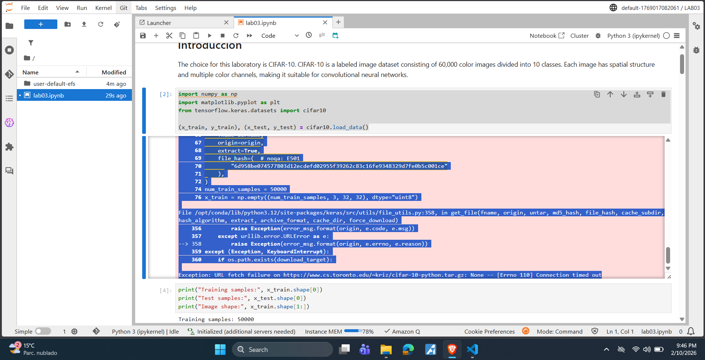
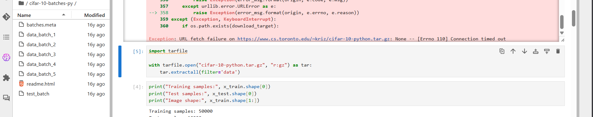
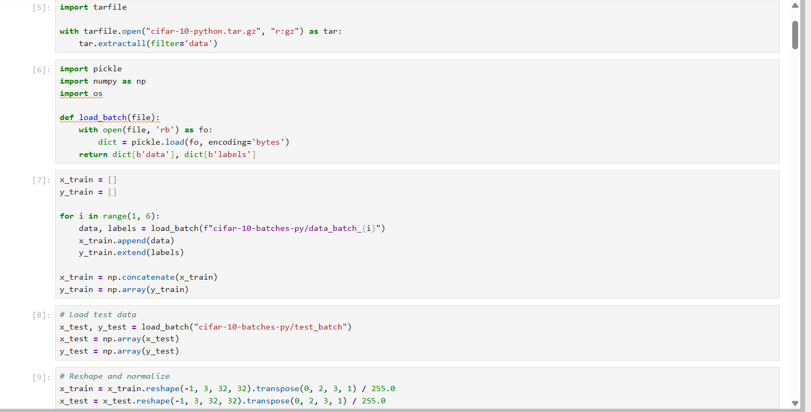
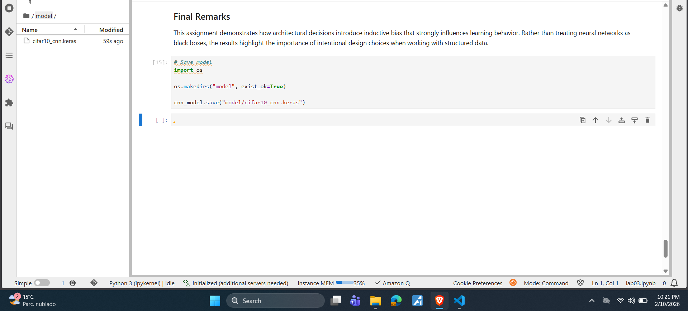
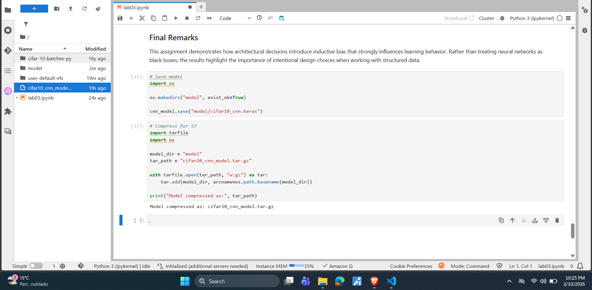
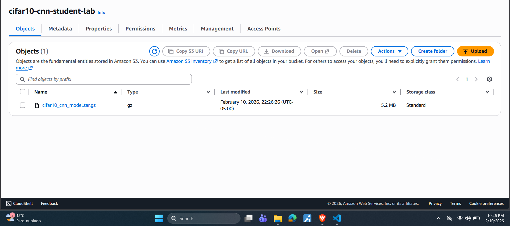
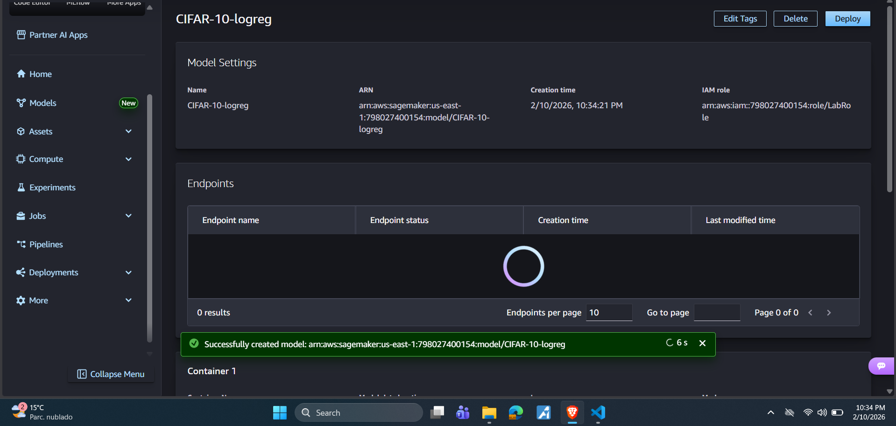
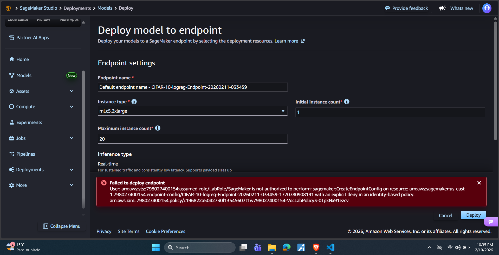

# CIFAR-10 Convolutional Neural Networks

## Problem Description

This project explores convolutional neural networks (CNNs) as architectural components rather than black boxes. The goal is to analyze how architectural decisions introduce inductive bias and affect learning, performance, and efficiency when working with image-based data.

A fully connected neural network is first implemented as a baseline reference. Then, a convolutional neural network is designed from scratch and compared against the baseline. Finally, a controlled experiment evaluates the impact of convolutional kernel size on performance.

---

## Dataset Description

The CIFAR-10 dataset is a publicly available image classification dataset consisting of 60,000 RGB images divided into 10 classes: airplane, automobile, bird, cat, deer, dog, frog, horse, ship, and truck.

* Total samples: 60,000
* Training samples: 50,000
* Test samples: 10,000
* Image dimensions: 32 × 32 × 3 (RGB)

The dataset is balanced across classes and contains objects that vary in position, orientation, and scale, making it suitable for convolutional architectures that exploit spatial structure.

---

## Exploratory Data Analysis (EDA)

A minimal exploratory analysis was performed to understand the dataset structure:

* Verification of dataset size and class balance
* Visualization of sample images per class
* Inspection of image dimensions and channels
* Normalization of pixel values to the [0, 1] range

This analysis confirms the presence of meaningful spatial patterns and local correlations that motivate the use of convolutional layers.

---

## Models

### Baseline Model (Fully Connected Network)

The baseline model processes images by flattening them into a one-dimensional vector, ignoring spatial relationships between pixels.

Architecture:

* Input: 32 × 32 × 3 image
* Flatten layer
* Dense (256, ReLU)
* Dense (128, ReLU)
* Dense (10, Softmax)

This model contains over 800,000 trainable parameters, most of which originate from the first dense layer. Flattening removes spatial structure and leads to inefficient learning for image-based tasks.

---

### Convolutional Neural Network (CNN)

A convolutional neural network was designed from scratch to explicitly leverage spatial locality and parameter sharing.

Architecture:

Input (32×32×3)
→ Conv2D (32 filters, 3×3, ReLU, same)
→ MaxPooling (2×2)
→ Conv2D (64 filters, 3×3, ReLU, same)
→ MaxPooling (2×2)
→ Flatten
→ Dense (128, ReLU)
→ Dense (10, Softmax)

This architecture preserves spatial relationships, reduces the number of parameters compared to the baseline, and introduces translation invariance through pooling.

---

## Controlled Experiment: Kernel Size

A controlled experiment was conducted to analyze the effect of convolutional kernel size. All architectural and training parameters were kept constant except for the kernel size.

Compared configurations:

* CNN with 3×3 kernels
* CNN with 5×5 kernels

Results showed that larger kernels increase the receptive field and parameter count but do not significantly improve performance. Stacking smaller kernels provides a more parameter-efficient way to capture spatial context.

---

## Results and Discussion

The convolutional model outperformed the fully connected baseline while using fewer parameters. This highlights the importance of architectural inductive bias when working with structured data such as images.

The kernel size experiment illustrates the trade-off between model complexity and efficiency, reinforcing why small kernels are commonly used in modern CNN architectures.

---

## Interpretation

Convolutional layers introduce an inductive bias that assumes local patterns are important and that features can appear anywhere in the image. This bias aligns well with visual data, leading to improved generalization and efficiency.

Convolutional architectures are less suitable for problems where spatial or local structure is not meaningful, such as tabular data or unordered feature sets.

---

### Dataset Loading in SageMaker

The CIFAR-10 dataset could not be downloaded using `keras.datasets` due to network restrictions in the SageMaker student environment.
To address this, the dataset was downloaded externally and loaded manually from local files.

This approach ensures full reproducibility and avoids dependency on external network access.

The trained CNN model was packaged into a .tar.gz archive following SageMaker conventions. The archive contains the saved Keras model and was uploaded to an S3 bucket to simulate a deployment workflow. Due to account restrictions in the student environment, endpoint creation was not permitted.

As the next step in the deployment, we create the model with a route to the bucket, with our ARN.

Finally, we get the AWS error because the education lab does not have the option to deploy endpoints available.

Despite the deployment limitation, the workflow demonstrates an understanding of the standard SageMaker model lifecycle: training, packaging, storage in S3, and deployment.
---

## Final Remarks

This project demonstrates how intentional architectural decisions shape learning behavior in neural networks. By comparing a baseline model, a convolutional architecture, and a controlled experiment, the assignment emphasizes understanding neural networks as designed systems rather than black-box

---
 
## Repository Structure
- lab03.ipynb: Main notebook with experiments and analysis
- README.md: Project overview and conclusions